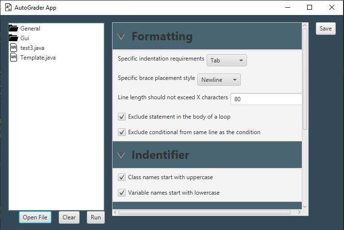

<div id="top"></div>

[![Contributors][contributors-shield]][contributors-url]
[![Forks][forks-shield]][forks-url]
[![Stargazers][stars-shield]][stars-url]
[![Issues][issues-shield]][issues-url]


<!-- PROJECT LOGO -->
<br />
<div align="center">
  <a href="https://github.com/github_username/repo_name">
    
  </a>

<h3 align="center">AutoGrader</h3>

  <p align="center">
    A program that will automatically, upon file selection, assess the file for indentation errors, bracket placement errors (or lack thereof), proper naming convention, and proper comments.
    <br />
    <a href="https://github.com/malsobrook/AutoGrader"><strong>Explore the docs »</strong></a>
    <br />
    <br />
    <a href="https://github.com/malsobrook/AutoGrader">View Demo</a>
    ·
    <a href="https://github.com/malsobrook/AutoGrader/issues">Report Bug</a>
    ·
    <a href="https://github.com/malsobrook/AutoGrader/issues">Request Feature</a>
  </p>
</div>


<!-- TABLE OF CONTENTS -->
<details>
  <summary>Table of Contents</summary>
  <ol>
    <li>
      <a href="#about-the-project">About The Project</a>
      <ul>
        <li><a href="#built-with">Built With</a></li>
      </ul>
    </li>
    <li>
      <a href="#getting-started">Getting Started</a>
      <ul>
        <li><a href="#prerequisites">Prerequisites</a></li>
        <li><a href="#installation">Installation</a></li>
      </ul>
    </li>
    <li><a href="#usage">Usage</a></li>
    <li><a href="#roadmap">Roadmap</a></li>
    <li><a href="#contributing">Contributing</a></li>
    <!--<li><a href="#license">License</a></li>-->
    <li><a href="#contact">Contact</a></li>
    <li><a href="#acknowledgments">Acknowledgments</a></li>
  </ol>
</details>


<!-- ABOUT THE PROJECT -->
## About The Project
<div align="center">
  <a href="https://github.com/github_username/repo_name">
    
  </a>
</div>

This application is intended to decrease the time spent grading programming assignments for a user. It will automatically generate reports for java source code. 

Once a file is selected and user preferences are selected, the program will parse through the file to determine the presence of indentation errors, bracket placement errors, and compare the majority used indent and bracket styles selected by the user to what the author of the source code used. 

The program will then store this information in a report by classification (indent, bracket, miscellaneous, etc.) and generate an HTML report with a recommended overall score and individual scores per section and scores on individual selections.

<p align="right">(<a href="#top">back to top</a>)</p>


### Built With

* [JavaFX](https://openjfx.io/)
* [picocli](https://picocli.info/)
* [GSON](https://github.com/google/gson)
* [Maven](https://maven.apache.org/)

<p align="right">(<a href="#top">back to top</a>)</p>


<!-- GETTING STARTED -->
## Getting Started

This is an example of how you may give instructions on setting up your project locally.
To get a local copy up and running follow these simple example steps.

### Prerequisites

This is an example of how to list things you need to use the software and how to install them.
* Maven
  ```sh
  https://maven.apache.org/download.cgi
  ```

### Installation

1. Clone the repo
   ```sh
   git clone https://github.com/malsobrook/AutoGrader.git
   ```

<p align="right">(<a href="#top">back to top</a>)</p>


<!-- USAGE EXAMPLES -->
## Usage

Coming Soon!

<p align="right">(<a href="#top">back to top</a>)</p>


<!-- ROADMAP -->
## Roadmap

- [ ] Assess java packages to ensure all code is contained in a package
- [ ] Run the program on C language files, prioritizing C++
    - [ ] Implement C language features (headers, guards, preprocessor directives)

See the [open issues](https://github.com/malsobrook/AutoGrader/issues) for a full list of proposed features (and known issues).

<p align="right">(<a href="#top">back to top</a>)</p>


<!-- CONTRIBUTING -->
## Contributing

Contributions are what make the open source community such an amazing place to learn, inspire, and create. Any contributions you make are **greatly appreciated**.

If you have a suggestion that would make this better, please fork the repo and create a pull request. You can also simply open an issue with the tag "enhancement".
Don't forget to give the project a star! Thanks again!

1. Fork the Project
2. Create your Feature Branch (`git checkout -b feature/AmazingFeature`)
3. Commit your Changes (`git commit -m 'Add some AmazingFeature'`)
4. Push to the Branch (`git push origin feature/AmazingFeature`)
5. Open a Pull Request

<p align="right">(<a href="#top">back to top</a>)</p>


<!-- CONTACT -->
## Contact

Michael Alsobrook - malsobrook1@murraystate.edu
Taylor Hunt - thunt10@murraystate.edu
Marshal McKee - mmckee6@murraystate.edu

Project Link: [https://github.com/malsobrook/AutoGrader](https://github.com/malsobrook/AutoGrader)

<p align="right">(<a href="#top">back to top</a>)</p>


<!-- ACKNOWLEDGMENTS -->
## Acknowledgments

* [Dr. Tennyson, Murray State University]()
* [Java Style Guide](https://google.github.io/styleguide/javaguide.html))
* [Java Source Code Research](http://ceur-ws.org/Vol-1852/p14.pdf)
* [README Template](https://github.com/othneildrew/Best-README-Template/graphs/contributors)

<p align="right">(<a href="#top">back to top</a>)</p>


<!-- MARKDOWN LINKS & IMAGES -->
<!-- https://www.markdownguide.org/basic-syntax/#reference-style-links -->
[contributors-shield]: https://img.shields.io/github/contributors/github_username/repo_name.svg?style=for-the-badge
[contributors-url]: https://github.com/malsobrook/AutoGrader/graphs/contributors
[forks-shield]: https://img.shields.io/github/forks/github_username/repo_name.svg?style=for-the-badge
[forks-url]: https://github.com/malsobrook/AutoGrader/network/members
[stars-shield]: https://img.shields.io/github/stars/github_username/repo_name.svg?style=for-the-badge
[stars-url]: https://github.com/malsobrook/AutoGrader/stargazers
[issues-shield]: https://img.shields.io/github/issues/github_username/repo_name.svg?style=for-the-badge
[issues-url]: https://github.com/malsobrook/AutoGrader/issues
